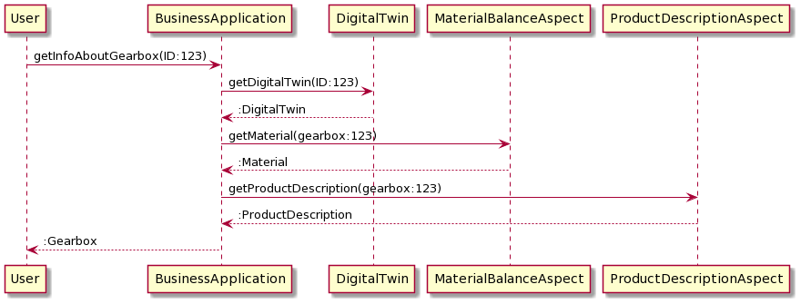

**SAMM method documentation, tool and training**

For general introduction to SAMM refer the official website of [Eclipse ESMF] (https://openmanufacturingplatform.github.io/sds-documentation/bamm-specification/snapshot/index.html)

**SAMM Modeling methodology Digital Twins**

**Introduction**

A Digital Twin System forms the basis for comprehensive digitization of production and logistics by gradually creating consistent data homogeneity and interoperability.

 
Any asset — it can be an actual physical asset like a drilling machine but also something virtual like a web service — has a digital representation with consistent semantics, called a Digital Twin. Digital Twins represent those assets and services and provide a shell for their Aspects which define the functionality the Digital Twin supports. Aspects provide the actual data of the Digital Twin that clients can use. Think of an Aspect as a live thing, i.e., a service that can be queried to retrieve current or aggregated data. The data can be anything from a single numeric value — e.g., a temperature sensor — to a complex block of data.
Each Aspect references a concrete Aspect Model. This model describes in a formal, i.e., machine readable, format, how an Aspect is structured and what the data actually means. The model describes for example the used physical unit and possible value range of the temperature sensor. Note that even in this simple example, a conventional approach could not satisfyingly answer the question of where this kind of information would otherwise live — in the sensor’s data sheet that is only a human-readable document? In the Aspect’s API documentation that is also only human-readable? Should the information about the sensor’s physical range be hard-coded in the Aspect and included in each service reply, even though it never changes? By expressing it in the Aspect model, the Aspect’s semantics can be made available to consumers of the data in a way that opens up new possibilities.

Therefore, an Aspect model contains both information about runtime data structure (e.g., that there is a property in the data called "temperature", and that it has a numeric value) and information that is not part of the runtime data (e.g., the unit or range). It does not, however, contain actual runtime data (e.g., a numeric value representing the current temperature), as this will be delivered by an Aspect conforming to this Aspect model. The combination of raw runtime data and its corresponding Aspect model yields information.
To specify an Aspect Model, the Semantic Aspect Meta Model (SAMM) [[samm](https://openmanufacturingplatform.github.io/sds-bamm-aspect-meta-model/bamm-specification/snapshot/index.html)] is used.

**Illustration of using SAMM for Digital Twin Modeling**

The models describe so called aspects of a digital twin. A digital twin is a digital representation of a physical asset, which might expose different data and operations. Depending on what a business application is interested in, different values and operations might be relevant, which often can be grouped. Such groupings can be modeled with Aspect models.

An Aspect model describes what data and operations can be accessed. An aspect model is instantiated for a concrete digital twin (cf represents a concrete physical asset) and will provide you with the specified properties and operations.

An example: As a physical asset you have a concrete gearbox. For the gearbox a digital twin is defined which in our case consists of the two aspects Material and ProductDescription. 

The actual implementation of these Aspects is done via – for example – a web-service which provides the actual data for the aspect of the specific gearbox. So with the Aspect model we express the structure and semantics of the data coming from that data source. The APIs of the two web services for both aspects could look like the following (generated with the Eclipse SAMM SDK)

The web services that implement the aspects can then be used by a business application that provides an overview of the materials within the gearbox. The business application requests the required data for the specific gearbox from such a web service in the format that the Aspect Model defines. The return values of a get request for the ProductDescription aspect would look like this

In this example the digital twin would provide the business application with the references (URI, etc.) to this specific data source for the Aspects.

The interaction with the digital twin looks like in the following UML sequence diagram.

Conversely – but not illustrated in the picture above –  an aspect can also describe operations of a digital twin. In that case a business application would not request data from an Aspect-implementing web service but rather call an operation to trigger some behavior of the digital twin. An example, but not related to the example from the actual CE use case above,  an aspect could provide an operation to move a robot arm to a certain position in space.

**_General Remarks to SAMM_**

SAMM is specified within the Eclipse ESMF project. the SAMM Specification can be found [here](https://openmanufacturingplatform.github.io/sds-bamm-aspect-meta-model/bamm-specification/snapshot/index.html). The specification contains also an introduction to the modeling elements of SAMM. For an introduction of the model elements and its use, please have a look [here](https://openmanufacturingplatform.github.io/sds-bamm-aspect-meta-model/bamm-specification/snapshot/modeling-guidelines.html). The general structure of a SAMM model is, that it defines one Aspect of a digital twin, which exposes one or more properties, whose data type and semantics are specified with a Characteristic. A Characteristic can be reused among properties. For details please have a look into the specification and the modeling guide for an in depth explanation of the modeling elements.

The Meta Model is specified using the Resource Description Format (RDF, [[rdf11]](https://openmanufacturingplatform.github.io/sds-bamm-aspect-meta-model/bamm-specification/snapshot/appendix/appendix.html#rdf11)) and the Terse RDF Triple Language syntax (TTL, [[turtle]](https://openmanufacturingplatform.github.io/sds-bamm-aspect-meta-model/bamm-specification/snapshot/appendix/appendix.html#turtle)), together with validation rules in the Shapes Constraint Language (SHACL, [[shacl]](https://openmanufacturingplatform.github.io/sds-bamm-aspect-meta-model/bamm-specification/snapshot/appendix/appendix.html#shacl)). Aspect models are likewise specified in RDF/Turtle, following SAMM semantics [[bamm](https://openmanufacturingplatform.github.io/sds-bamm-aspect-meta-model/bamm-specification/snapshot/index.html)]. 

Based on the Meta Model an SDK is provided by the Open Manufacturing Platform, which can be used to realize digital twins and their aspect implementations. The SDK can be found [here](https://github.com/OpenManufacturingPlatform/sds-sdk). 

**Modeling Approach**

The modeling of Aspects of Digital Twins most likely will happen in the broader context of an digitalization effort, which implies that basically two approaches – top-down or bottom-up – to identify and model Aspects are possible. In the top-down modeling process, you start with the idea for an Aspect model but have no prior data model (e.g. JSON structure). In the bottom-up modeling process, you start with an existing data model, i.e. you already have a REST service and you want that the data provided by an aspect matches an existing JSON structure.

Generally, the top-down should be preferred as it usually yields better structured models that do not make concessions towards an already existing implementation and by that better reflect the actual domain.

Top-Down Approach:

1. Collect and understand the data that needs to be contained in Aspects
> a. Questions to be answered: Is it relevant? How is it going to be used?

> b. Avoid bloating models with Properties or other structure that "might be needed at some point". Model evolution should be preferred over adding a lot of structure upfront.

> c. Consider creating a rough (informal) domain model draft or concept map to validate a shared understanding with the expert(s)

2. Separate data into Aspects to maximize [cohesion](https://en.wikipedia.org/wiki/Cohesion_(computer_science)) and reusability
> a. There is no single "correct" way to separate data into Aspects, but one rule of thumb is to put those Properties together into one Aspect model that most likely are going to be queried together at runtime

3. Decide on the meta data of the model
> a. Pick a descriptive but concise model name

> b. Pick a version for the model. If this is the first version, start with 1.0.0

> c. Pick a namespace for the model

4. Analyze each designated Property in your model draft
> a. Give the Property a speaking name.

> b. Can a predefined [Characteristic instance](https://openmanufacturingplatform.github.io/sds-bamm-aspect-meta-model/bamm-specification/v1.0.0/characteristics.html#characteristics-instances) be used for the Property, or one of the predefined [Characteristics classes](https://openmanufacturingplatform.github.io/sds-bamm-aspect-meta-model/bamm-specification/v1.0.0/characteristics.html#characteristics-classes) be instantiated?

> c. It is always preferable to use something that is already there. It makes the model easier to understand and the resulting Aspect easier to use. For example, the SDK might already offer some convenience for Characteristic instances in implementations and solutions.

5. Add [Constraints](https://openmanufacturingplatform.github.io/sds-bamm-aspect-meta-model/bamm-specification/v1.0.0/characteristics.html#constraints) to the Characteristic as necessary.

6. Complete the model
> a. Define example values where it makes sense

> b. Add proper descriptions and preferred names, at least in English

> c. Check names and descriptions for typos and grammar mistakes

Bottom-Up-Approach:

In the bottom-up modeling process, you start with an existing data model, i.e. you already have a REST service and you want the payload structure that follows the Aspect model to match the existing JSON structure. This might be necessary when you want to make the existing service a valid Aspect but can not or want not change its data structure.

The existing data structure replaces the model draft as compared to the top-down modeling process.

1. Enter step 3 from the top-down modeling process

2. When defining a Property, you should use the name of the existing corresponding key in the data structure to allow for a one to one mapping between Aspect model and JSON structure.

3. Make sure that the resulting Aspect-model yields the same JSON document structure as the son-document initially used to model the Aspect model.

Note: When building an Aspect model to match an existing data structure, there may be mismatches in the defined value spaces of the Characteristics used in the model and the runtime data provided by the Aspect. For example, you might want to define a Property timestamp and use the existing [Timestamp](https://openmanufacturingplatform.github.io/sds-bamm-aspect-meta-model/bamm-specification/v1.0.0/characteristics.html#timestamp-characteristic) Characteristic, but the existing data model expects numeric values (i.e. [numbers of seconds](https://en.wikipedia.org/wiki/Unix_time)), while the Timestamp Characteristic has a dataType of xsd:dateTime which in turn expects values such as "2000-01-01T14:23:00". Mismatches like this can either be resolved in the model (i.e. do not use the Timestamp Characteristic) or in the Aspect implementation (e.g. by on-the-fly conversion of values). Either way, the provided runtime value must match the Characteristic of the Property in the model.

Using SAMM for Aspect Modelling
Example models can be found here [Getting Started with Aspect Modeling based on BAMM](https://github.com/eclipse-tractusx/sldt-semantic-models/blob/main/documentation/Getting-Started-with-Aspect-Modeling-based-on-BAMM.md).
