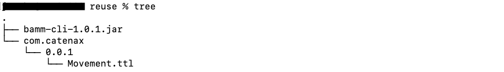
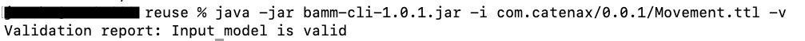
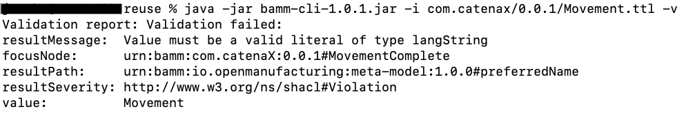
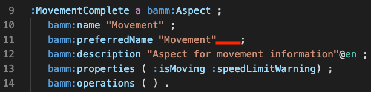
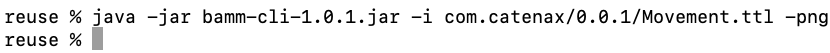
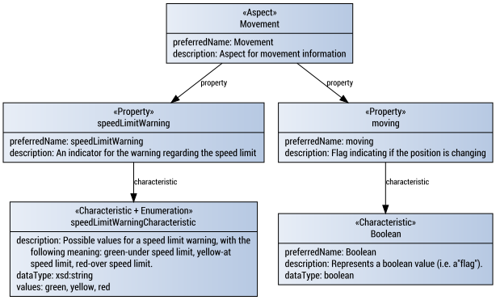

The intention of the following page is to give an introduction on modeling an aspect model based on the Semantic Aspect Meta Model (SAMM). 

**Prerequisites**

For the first part of this guide, you do not require any pre requisites installed on your machine since it stays on the conceptual level. But we recommend that you follow the modeling steps on your machine which can be done with every text editor (e.g. VS Code, Notepad++, Emac, VI).

When interacting with created aspect models you need the SAMM CLI and an installation of the Java Runtime to execute the SAMM CLI. References on on how to download install both are given below.  

**Motivation**

With an aspect model one can describe the structure and semantics of data that is coming from a data source. This data source can also be referred to as the aspect implementation. The aspect model and an aspect implementation together form an aspect. With this interpretation each aspect model may match with multiple aspect implementation that each conform to the interface defined by the aspect model. Thus creating the aspect model is a good way to exchange and reach agreement on the data to expect and the meaning of that data.

To establish a common and inter-operable understanding of the definition in an aspect model that can also be interpreted by a computer, one needs to agree on the way the aspect models are expressed. In other more colloquial words, we need a meta model to agree on a common vocabulary and language for describing aspect models. The aim of the SAMM Aspect Meta Model is to be such a meta model for expressing aspect models. SAMM itself is defined and maintained as [open source in the Eclipse ESMF project](https://github.com/eclipse-esmf/esmf-semantic-aspect-meta-model) . In conjunction to the elements defined in SAMM, there are [additional libraries and tooling](https://github.com/eclipse-esmf/esmf-sdk) to make the interaction with aspect models that are based on SAMM easier. 

The following guide, first introduces the general process of writing an aspect model based on SAMM based one a simple example use case. In a second step we show how to use the tooling around SAMM to interact with the aspect models. 

**Use Case**

Let's assume we have an AGV (Autonomous Guided Vehicle) which is moving. This AGV then communicates its movement information to a database from which we can retrieve the current movement state. This database would then be an aspect implementation. For that aspect implementation we now want to develop an aspect model describing the aspect of movement for the AGV. 

Our domain expert gave us the following JSON data for the data returned by the aspect implementation (database):

```
{

  "moving" : true,

  "speedLimitWarning" : "green"

}
```

In addition, we get the following information: 

> 1. The field "moving" is Boolean and can thus either be true or false
> 2. The speed limit warning can either be : 


**Aspect Model**:

As explained above, we want to come up with the aspect model for the Movement Aspect of the AGV. We can express this model in the form of a [Turtle](https://www.w3.org/TeamSubmission/turtle/) file. Turtle is file format which allows the expression of RDF graphs in natural text form. This allows the usage of the aspect model also for more elaborate use cases involving and queries. But while getting started with modeling it is not necessary to understand the implications of using Turtle files and RDF for the modeling and we will show how a basic Turtle files for aspect models could look like in the following.

**SAMM**

The aspect models that we are going to write, are based on the elements defined in the [Semantic Aspect Meta Model](https://openmanufacturingplatform.github.io/sds-documentation/bamm-specification/snapshot/meta-model-elements.html) . For this guide no prior knowledge of SAMM and its elements is required as the intention of this guide is to introduce the most relevant concepts and elements defined in SAMM. However, if you want to know more details, we recommend that you consult the [SAMM documentation](https://openmanufacturingplatform.github.io/sds-documentation/bamm-specification/snapshot/meta-model-elements.html). The following graphic gives an overview of the main elements in SAMM:


**Modeling**

For the modeling you can use any text editor like for example VS Code, Notepad, vi and so on and then later save the model file with the subfix .ttl. To get started open your favorite editor and enter the following text, which is the beginning of our aspect model:

**Start of Movement.ttl**

```
@prefix : <urn:bamm:com.catenax:0.0.1#>.
@prefix bamm: <urn:bamm:io.openmanufacturing:meta-model:1.0.0#>.
@prefix unit: <urn:bamm:io.openmanufacturing:unit:1.0.0#>.
@prefix bamm-c: <urn:bamm:io.openmanufacturing:characteristic:1.0.0#>.
@prefix bamm-e: <urn:bamm:io.openmanufacturing:entity:1.0.0#>.
@prefix xsd: <http://www.w3.org/2001/XMLSchema#> .
@prefix rdfs: <http://www.w3.org/2000/01/rdf-schema#> .
 
:Movement a bamm:Aspect ;
   bamm:name "Movement" ;
   bamm:preferredName "Movement"@en ;
   bamm:description "Aspect for movement information"@en ;
   bamm:properties ( :isMoving :speedLimitWarning) ;
   bamm:operations ( ) .
```

Let's see what is happening here. The Turtle files start with the definition of a couple of prefixes defining shortcuts for several URNs. For instance, :Movement then actually translates urn:bamm:com.catenax:0.0.1#Movement as the : is a placeholder for the actual urn (in our case <urn:bamm.com.catenax:0.0.1#> . This way we can also reference the elements defined in SAMM (prefix bamm, prefix unit, prefix bamm-c, or prefix bamm-e). These prefixes are known and can be resolved by to the tooling around SAMM mentioned below. 

The definition of the actual Aspect starts in line 9 by stating: ":Movement a bamm:Aspect". This defines that the Movement is an Aspect element defined in SAMM. An Aspect element is the entry point of each aspect model. The next lines adds additional information on the Aspect. For more details on the different fields one can check the [documentation of an Aspect](https://openmanufacturingplatform.github.io/sds-documentation/bamm-specification/snapshot/modeling-guidelines.html) . 

The bamm:name is the name of the aspect and should only contain alphabetic or numeric characters and no whitespaces. The reason is that this name may be used as a property name in a programming code that gets generated based on the aspect model. Next, there are the "preferredName" and the "description". Both fields are intended to be interpreted by humans and may be used in user interfaces and similar systems and should be human-readable. For internationalization, it is possible to state them in multiple languages which are then identified by the tag after the `@`sign. In general, we advise you to at least state the English version and then add other languages whenever required. 

The fields described so far, exist in all elements defined in SAMM. The fields for bamm:operation and bamm:properties are specific to Aspects.

The operation allows to express that the Aspect can compute an output based on a given input. To limit complexity, our example Movement Aspect does not allow any input from the user of the Aspect and we leave the list in bamm:operations empty here. One example in which we could have defined an operation would be if we extended our aspect implementation with a functionality to send a desired speed to the AGV. It would then be the task of the aspect implementation and thus in the end of the AGV to process this information. Optionally this processing could result in the return value like for example a boolean indicating whether the speed adjustment was performed successfully.  

The bamm:properties is a list referencing the Properties of the Aspect. In Aspect models, a Property represents a value or in other words, indicates the presence of a data value. The following excerpt shows how we could model the Properties in our use case:

**Properties in Movement.ttl**

```
:isMoving a bamm:Property ;
   bamm:name "moving" ;
   bamm:preferredName "moving"@en ;
   bamm:description "Flag indicating if the position is changing"@en ;
   bamm:characteristic bamm-c:Boolean .
 
 
:speedLimitWarning a bamm:Property ;
   bamm:name "speedLimitWarning" ;
   bamm:preferredName "speedLimitWarning"@en ;
   bamm:description "An indicator for the warning regarding the speed limit"@en ;
   bamm:characteristic :speedLimitWarningCharacteristic .
```

As we can see in the excerpt, the structure for defining a Property has many similarities to the definition of the Aspect element and does again include the fields bamm:name, bamm:preferredName, bamm:description, bamm:characteristic . Note, that the entries for bamm:name match the names of the fields in the initial JSON file. 

An important point here is that the property only indicates the existence of a value, but does not define how the expected value type looks like. In SAMM this is separated into another model element, namely the Characteristic. This is the reason why the Property has a field bamm:characteristic to reference to the type information defined in a Characteristic. 

As explained above, our domain expert told us that :isMoving is of type Boolean. As this is a more easy and generic data type it has already been defined in SAMM and we can simply reuse and reference it by writing bamm-c:Boolean. Under bamm-c, one can reference several characteristics and types of Characteristics. For more details check the [documentation on Characteristics](https://openmanufacturingplatform.github.io/sds-documentation/bamm-specification/snapshot/characteristics.html).

For the :speedLimitWarning we need to define our own :speedLimitWarningCharacteristic because it is specific to our Aspect model:

**Characteristics in Movement.ttl**

```
:speedLimitWarningCharacteristic a bamm-c:Enumeration;   
    bamm:name "speedLimitWarningCharacteristic"@en;
    bamm:description "Possible values for a speed limit warning, with the following meaning: green - under speed limit, yellow - at speed limit, red - over speed limit."@en;
    bamm:dataType xsd:string;
    bamm-c:values ("green" "yellow" "red") .
```

The most generic way of defining a Characteristic would have been to write ":speedLimitWarningCharacteristic a bamm:Characteristic" . But we already know that the value of our speed limit warning will come from a list of predefined possible values. In SAMM there is already the special Characteristic called Enumeration for the cases where you can state the possible values. This is also the reason for writing "bamm-c:Enumeration" and not "bamm:Enumeration" as in the "bamm:Property", "bamm:Aspect", or "bamm:Characteristic". 

For the Enumeration, we need to define the basic dataType which in our case is String. More details on possible data type or how to define a custom data Type with an Entity is available under [Data Types in the SAMM documentation](https://openmanufacturingplatform.github.io/sds-documentation/bamm-specification/snapshot/datatypes.html). In :bamm-c:values we then give a list with the possible values. 

This already concludes the basic definition of the Aspect model for the Movement Aspect. Here is the complete model for reference which you could also copy to your editor (e.g., when starting to work with the SAMM CLI):


**Movement.ttl (complete)**

```
@prefix : <urn:bamm:com.catenaX:0.0.1#>.
@prefix bamm: <urn:bamm:io.openmanufacturing:meta-model:1.0.0#>.
@prefix unit: <urn:bamm:io.openmanufacturing:unit:1.0.0#>.
@prefix bamm-c: <urn:bamm:io.openmanufacturing:characteristic:1.0.0#>.
@prefix bamm-e: <urn:bamm:io.openmanufacturing:entity:1.0.0#>.
@prefix xsd: <http://www.w3.org/2001/XMLSchema#> .
@prefix rdfs: <http://www.w3.org/2000/01/rdf-schema#> .
 
:Movement a bamm:Aspect ;
   bamm:name "Movement" ;
   bamm:preferredName "Movement"@en ;
   bamm:description "Aspect for movement information"@en ;
   bamm:properties ( :isMoving :speedLimitWarning) ;
   bamm:operations ( ) .
 
:isMoving a bamm:Property ;
   bamm:name "moving" ;
   bamm:preferredName "moving"@en ;
   bamm:description "Flag indicating if the position is changing"@en ;
   bamm:characteristic bamm-c:Boolean .
 
 
:speedLimitWarning a bamm:Property ;
   bamm:name "speedLimitWarning" ;
   bamm:preferredName "speedLimitWarning"@en ;
   bamm:description "An indicator for the warning regarding the speed limit"@en ;
   bamm:characteristic :speedLimitWarningCharacteristic .
 
 
:speedLimitWarningCharacteristic a bamm-c:Enumeration;   
    bamm:name "speedLimitWarningCharacteristic"@en;
    bamm:description "Possible values for a speed limit warning, with the following meaning: green - under speed limit, yellow - at speed limit, red - over speed limit."@en;
    bamm:dataType xsd:string;
    bamm-c:values ("green" "yellow" "red") .
```


**Tooling & SAMM CLI:**

During the development of a new Aspect model, one can get support from tools such as the SAMM CLI (SAMM Command Line Interface). The SAMM CLI is software which does not have a visual user interface and can be executed through the [Terminal](https://en.wikipedia.org/wiki/Shell_%28computing%29) of your computer (e.g., cmd in Windows or Terminal in MacOS). 

The SAMM CLI has multiple features supporting the development of Aspect models and allowing the generation of artifacts like PNG images or HTML documentations based on the developed Aspect model. For more details and the download link to the SAMM CLI, visit the the [documentation](https://openmanufacturingplatform.github.io/sds-documentation/sds-developer-guide/tooling-guide/bamm-cli.html) or the [respective GitHub repository](https://github.com/OpenManufacturingPlatform/sds-sdk/tree/main/tools/bamm-cli). 

The SAMM CLI uses the implementation from the [ESMF SDK](https://github.com/eclipse-esmf/esmf-sdk). The ESMF SDK is a collection of libraries interacting with Aspect models and gets maintained by Eclipse ESMF project.

**General Usage**

The SAMM CLI gets distributed as JAVA JAR-File, which is a distribution format for applications written in the JAVA programming language. That is also the reason why one needs an instance of the Java (Runtime) installed in the machine which also is part of the JDK (Java Development Kit). The terminal through which you execute the SAMM CLI also needs to have access to the Java Runtime. The [Adopt OpenJDK](https://adoptopenjdk.net/index.html) and its [installation guide](https://adoptopenjdk.net/installation.html) or are a good staring point to get Java up and running. However, the way you want to install Java strongly depends on your local setup and personal preference like the used operating system or Java distribution and a quick web search should return a couple of results for your specific environment .  

Once you installed Java and downloaded the SAMM CLI, it is possible to start the SAMM CLI by executing the following command in the terminal in the directory where the SAMM CLI is located: 

java -jar bamm-cli-version.jar

You need to replace the version with a specific version of the SAMM CLI that you are using. The command should then output some information on the possible usage options for the SAMM CLI. In the following, we will go through a couple of these options.

Import file (-i) 
To allow the SAMM CLI to perform operations on an Aspect model, we first need to let the SAMM CLI load the model file. With the parameter -I one tells the SAMM CLI the location for the developed Aspect mode file. 

So the full command for importing the file would be:

java -jar bamm-cli-version.jar -i <namespace>/<version>/NameOfAspect.ttl  

The SAMM CLI assumes a specific folder structure for the file system where the aspect model is stored. This structure follows the namespace and the version in the URN of the model elements. In our Movement aspect example the beginning of the URN would be: <urn:com.catenax:0.0.1#> (see line with "@prefix : <urn:com.catenax:0.0.1#>"). The resulting recommended and expected folder structure is then the <namespace>/<version> which leads in our example to the structure com.catenax/0.0.1. For more details on the expected file structure visit the [SAMM CLI documentation](https://openmanufacturingplatform.github.io/sds-documentation/sds-developer-guide/dev-snapshot/tooling-guide/bamm-cli.html#models-directory-structure). Note, that SAMM CLI may allow folder names other than the namespace, if the imported files does not contain references to custom model elements that are defined in other files.

The following screenshot shows, how the folder structure could look like for our example aspect:



**Validate**

An essential step, especially during the development of an Aspect model, is to validate whether the model complies with the underlying meta-model. One can perform the validation by adding the option -v:

java -jar bamm-cli-version.jar -i <namespace>/<version>/NameOfAspect.ttl  -v

If the model is valid, the SAMM CLI will print "Validation report: Input model is valid" as shown in the following screenshot:



If the model is not valid, the SAMM CLI will print the validation error which then looks like in the next screenshot:



Try to make a guess, what could have been the issue here.

In this case, the error was that the value/object for the preferredName in line 11 was missing the language tag. Similar to the description in line 12, it was "@en" in the valid model to indicate, that the string is in English language.



**Generate PNG**

A good way for getting an overview of the structure and the elements in the Aspect model is to generate a graphical representation. In the case of the BAMM CLI, this is possible in the form of a PNG image by adding the option -png :

java -jar bamm-cli-version.jar -i <namespace>/<version>/NameOfAspect.ttl  -png



For the Movement Aspect introduced above the picture then is: 




**Generate HTML**

It is also possible to generate HTML documentation for the Aspect model. This makes the description information from the aspect model available in a more human-readable and accessible form. To generate an HTML documentation add the option -html : 

java -jar bamm-cli-version.jar -i <namespace>/<version>/NameOfAspect.ttl  -html 

In the default configuration, the SAMM CLI uses a style that is influenced by the Open Manufacturing Platform since the SAMM CLI is maintained in the scope of that organization. However, it is possible to use a custom style to adapt to the use case by adding the option -hccf ( --html-custom-css-file) to specify an alternative CSS file for the styling. For Catena-X we already created [a CSS file](https://github.com/catenax/tractusx/blob/main/semantics/semantic-hub/src/main/resources/catena-template.css) that applies the logo and coloring scheme to the generated HTML documentation. 

In general, we advise using "self-contained" CSS files which do not reference external files. In the given examples, we achieved this by adding the logos directly to the CSS files as a base64 encoded block.  

**Generate JSON**

Another option of the SAMM CLI is to generate a JSON with an example payload that conforms to the described Aspect model. This example may be helpful when checking whether the Aspect model aligns with already available test data or when one wants to generate additional test data. One can create the example JSON with the option -json : 

java -jar bamm-cli-version.jar -i <namespace>/<version>/NameOfAspect.ttl  -json

For the Movement Aspect such a JSON would look like the following:

```
{
  "moving" : true,
  "speedLimitWarning" : "green"
}
```


**Wrap Up**

Congratulation, if you reached this point of the guide, you managed to create your first aspect model based on SAMM. You can use the presented aspect model as a template for creating your own aspect models.

If you want to propose or create your own aspect model to be used within Catena-X you can open an issue in [this GitHub repository](https://github.com/eclipse-tractusx/sldt-semantic-models) to get in contact with the modeling community.


