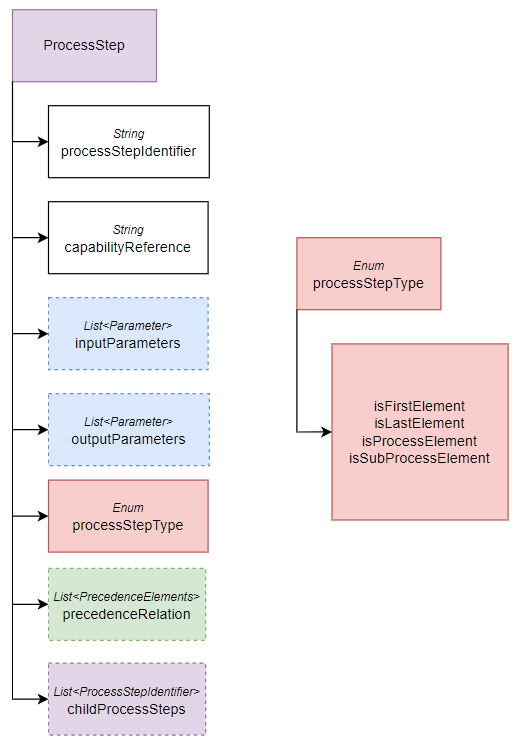
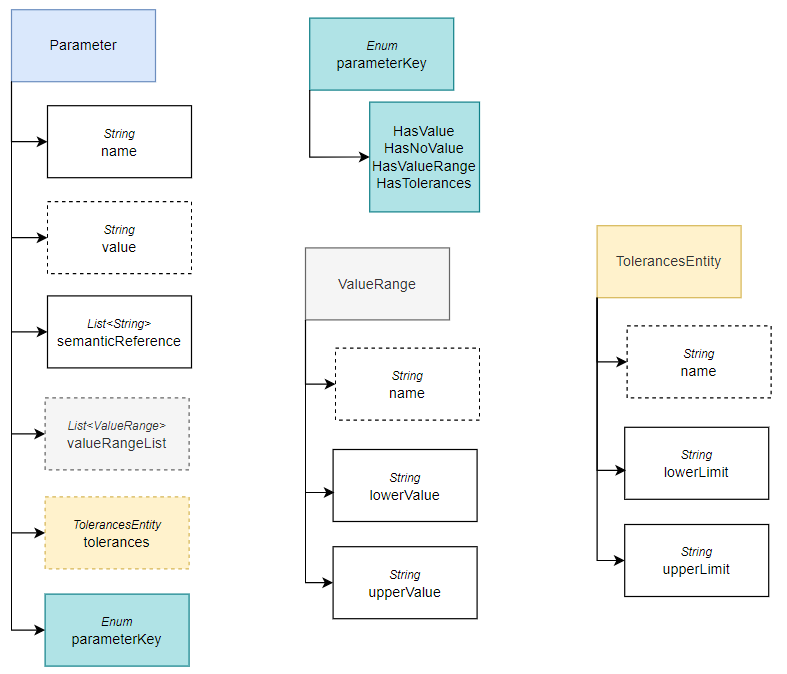

# Bill of Process Shared Aspect Model

The bill of process aspect model is a data model which can be utilized to exchange information about a product's manufacturing process between partners.
The purpose of this model is to specify an extended precedence graph that features the parameter flow between single process steps.
Since it is not part of an individual Catena-X standard, additional information about its application is provided with this README.md file.
The model itself is defined as a shared aspect to be included into other aspect models and will be used in the Catena-X Standard Request for Quotation.
Besides, the bill of process aspect model is referenced within the production tracking data model of the Shop Floor Information Service,
and within the Manufacturing Capability data model.

This README.md provides additional information about the entities, properties and characteristics of the bill of process aspect model:


## Bill of Process

The bill of process data model defines a set of mandatory properties to provide information about the product to be produced. 

<p align="center">
    
</p>

At the top level, the BillOfProcess entity provides a property version that represents the version of the data model, a unique identifier for the bill of process, and a name for the product 
whose manufacturing process is specified. In addition, a productVersion can be 
specified to distinguish between different product variants, such as the same product in different colors. The BillOfProcess entity also
contains a property process that contains a list with all process steps. These steps may be provided in any given order, 
since the relation between them is handled internally within the ProcessStep entity. However, each processStep instance that is part of the 
precedence graph has to be modeled explicitly. In consequence, it is not possible to define and reuse generic process steps, 
e.g. a transport process step, that occurs on multiple positions 
of the precedence graph. Instead, an individual process step has to be modeled for each transport step within the precedence graph.

## Process Step 

Process steps are listed within the process property of the bill of process entity. Each process step provides a unique identifier and refers to
a manufacturing capability that must be performed on a product to accomplish the corresponding process step. 
This capabilityReference must point to an instance of the Manufacturing Capability aspect model that is defined in the
namespace io.catenax.manufacturing_capability. In addition, each process step can feature an optional set of input and output parameters.
The corresponding entity for parameters and how to use them is explained in the section [Parameter](#Parameter).


<p align="center">
    
</p>

The optional property precedenceRelation allows the specification of dependencies to subsequent process steps. More details on how 
to span the precedence graph from the single process steps can be found in the section [Precedence Relation](#Precedence-Relation). 
In addition, a process step can feature a set of childProcessSteps, to break it down into smaller process steps. 
For example, a process step transport can be specified with the childProcessSteps pick, 
move and place. These process steps are referenced by their associated processStepIdentifiers.

```
#example relation between a processStep and its childProcessSteps
{
    "process" : 
    [ 
      {
        "childProcessSteps" : [ "pick", "move", "place" ],
        "capabilityReference" : "transport",
        "processStepIdentifier" : [ "1234-transport" ],
        "processStepType" : "IsFirstElement"
      },
      {
        "capabilityReference" : "pick",
        "processStepIdentifier" : [ "pick" ],
        "processStepType" : "isSubProcessElement",
        "precedenceRelation" : [ {
            "precedenceElements" : [ {
              "successor" : [ "move" ]
            } ]
          } ]
      },
      {
        "capabilityReference" : "move",
        "processStepIdentifier" : [ "move" ],
        "processStepType" : "isSubProcessElement",
        "precedenceRelation" : [ {
            "precedenceElements" : [ {
              "successor" : [ "place" ]
            } ]
          } ]
      },
      {
        "capabilityReference" : "place",
        "processStepIdentifier" : [ "place" ],
        "processStepType" : "isSubProcessElement"
      } 
    ]
}
```


The processStepType classifies each process step into one of four classes and is intended to simplify the 
spanning of the precedence graph:

### Case 1: isFirstElement

The first process steps of the precedence graph are labeled with the processStepType instance isFirstElement.

### Case 2: isLastElement

The last process steps of the precedence graph are labeled with the processStepType instance isLastElement.

### Case 3: isProcessElement

Ordinary process steps of the precedence graph, which are not at the first or last position, are labeled with the processStepType 
instance isProcessElement.

### Case 4: isSubProcessElement

Process steps that do not occur directly in the precedence graph, but are referenced to through the property childProcessSteps, are 
labeled with the processStepType instance isSubProcessElement. In contrast to process steps that are 
concrete elements of the precedence graph, process steps labeled with isSubProcessElement can be defined in a generic manner, 
allowing them to be associated with multiple parent process steps. In addition, defined input and output parameters for 
childProcessSteps must match the input and output parameters of the parent process step. An example of a generic set of
childProcessSteps with a parameter flow is illustrated below.

```
#extension of the example relation between a processStep and its childProcessSteps 

{
    "process": [
        {
            "childProcessSteps": [
                "pick",
                "move",
                "place"
            ],
            "capabilityReference": "transport",
            "processStepIdentifier": [
                "1234-transport"
            ],
            "processStepType": "IsFirstElement",
            "precedenceRelation": [
                {
                    "precedenceElements": [
                        {
                            "successor": [
                                "5678-transport"
                            ]
                        }
                    ]
                }
            ],
            "inputParameter": [
                {
                    "name": "weight",
                    "parameterKey": "HasNoValue",
                    "semanticReference": [
                        "0173-1#02-BAD875#008"
                    ]
                }
            ],
            "outputParameter": [
                {
                    "name": "weight",
                    "parameterKey": "HasNoValue",
                    "semanticReference": [
                        "0173-1#02-BAD875#008"
                    ]
                }
            ]
        },
        {
            "childProcessSteps": [
                "pick",
                "move",
                "place"
            ],
            "capabilityReference": "transport",
            "processStepIdentifier": [
                "5678-transport"
            ],
            "processStepType": "IsLastElement",
            "inputParameter": [
                {
                    "name": "weight",
                    "parameterKey": "HasNoValue",
                    "semanticReference": [
                        "0173-1#02-BAD875#008"
                    ]
                }
            ]
        },
        {
            "capabilityReference": "pick",
            "processStepIdentifier": [
                "pick"
            ],
            "processStepType": "isSubProcessElement",
            "precedenceRelation": [
                {
                    "precedenceElements": [
                        {
                            "successor": [
                                "move"
                            ]
                        }
                    ]
                }
            ],
            "inputParameter": [
                {
                    "name": "weight",
                    "parameterKey": "HasNoValue",
                    "semanticReference": [
                        "0173-1#02-BAD875#008"
                    ]
                }
            ],
            "outputParameter": [
                {
                    "name": "weight",
                    "parameterKey": "HasNoValue",
                    "semanticReference": [
                        "0173-1#02-BAD875#008"
                    ]
                }
            ]
        },
        {
            "capabilityReference": "move",
            "processStepIdentifier": [
                "move"
            ],
            "processStepType": "isSubProcessElement",
            "precedenceRelation": [
                {
                    "precedenceElements": [
                        {
                            "successor": [
                                "place"
                            ]
                        }
                    ]
                }
            ],
            "inputParameter": [
                {
                    "name": "weight",
                    "parameterKey": "HasNoValue",
                    "semanticReference": [
                        "0173-1#02-BAD875#008"
                    ]
                }
            ],
            "outputParameter": [
                {
                    "name": "weight",
                    "parameterKey": "HasNoValue",
                    "semanticReference": [
                        "0173-1#02-BAD875#008"
                    ]
                }
            ]
        },
        {
            "capabilityReference": "place",
            "processStepIdentifier": [
                "place"
            ],
            "processStepType": "isSubProcessElement",
            "inputParameter": [
                {
                    "name": "weight",
                    "parameterKey": "HasNoValue",
                    "semanticReference": [
                        "0173-1#02-BAD875#008"
                    ]
                }
            ],
            "outputParameter": [
                {
                    "name": "weight",
                    "parameterKey": "HasNoValue",
                    "semanticReference": [
                        "0173-1#02-BAD875#008"
                    ]
                }
            ]
        }
    ]
}
```

## Precedence Relation

Precedence relations are specified to link the process steps and thus, create the precedence graph of the process. 
In this context, precedence relations of a process step always point to its direct successors. However, since precedence 
relations can contain conditions, such as alternatives between successors, a set of successors or successors that must 
be executed in parallel, the property precedenceRelation consists of three nested lists, that are utilized for each of 
these three cases.

<p align="center">

</p>

### Case: Arbitrary Order

In this scenario, step 1 has successors 2 and 3 which can be executed in an arbitrary order. Regardless of their execution order,
the process continues with step 4, so that the resulting process sequences are either 1 -> 2 -> 3-> 4 or 1 -> 3 -> 2 -> 4.

<p align="center">

</p>

Since the direct successor of both, 2 and 3, is undetermined, both subsequences 2 -> 3-> 4 and 3 -> 2 -> 4 are possible. In consequence, 
both process steps reference to the next process step that is unambiguously determined, step 4 in this example.

```
# example  arbitrary order
{
    "process": [
        {
            "processStepIdentifier": [
                "1"
            ],
            "processStepType": "isFirstElement",
            # steps 2 and 3 can be executed in an arbitrary order
            "precedenceRelation": [
                {
                    "precedenceElements": [
                        {
                            "successor": [
                                "2",
                                "3"
                            ]
                        }
                    ]
                }
            ]
        },
        {
            "processStepIdentifier": [
                "2"
            ],
            "processStepType": "isProcessElement",
            "precedenceRelation": [
                {
                    "precedenceElements": [
                        {
                            "successor": [
                                "4"
                            ]
                        }
                    ]
                }
            ]
        },
        {
            "processStepIdentifier": [
                "3"
            ],
            "processStepType": "isProcessElement",
            "precedenceRelation": [
                {
                    "precedenceElements": [
                        {
                            "successor": [
                                "4"
                            ]
                        }
                    ]
                }
            ]
        },
        {
            "processStepIdentifier": [
                "4"
            ],
            "processStepType": "isLastElement"
        }
    ]
}
```

### Case: Parallelism

In this scenario, step 1 has the successors 2 and 3 that must be executed in parallel. The process continues 
with step 4, so that the resulting process sequence is 1 -> 2,3 -> 4.

<p align="center">

</p>

Since step 2 and step 3 must be completed before starting step 4, both refer to step 4 as their successor.
```
# example  parallel process steps
{
    "process": [
        {
            "processStepIdentifier": [
                "1"
            ],
            "processStepType": "isFirstElement",
            #steps 2 and 3 have to be executed in parallel
            "precedenceRelation": [
                {
                    "precedenceElements": [
                        {
                            "successor": [
                                "2"
                            ]
                        },
                        {
                            "successor": [
                                "3"
                            ]
                        }
                    ]
                }
            ]
        },
        {
            "processStepIdentifier": [
                "2"
            ],
            "processStepType": "isProcessElement",
            "precedenceRelation": [
                {
                    "precedenceElements": [
                        {
                            "successor": [
                                "4"
                            ]
                        }
                    ]
                }
            ]
        },
        {
            "processStepIdentifier": [
                "3"
            ],
            "processStepType": "isProcessElement",
            "precedenceRelation": [
                {
                    "precedenceElements": [
                        {
                            "successor": [
                                "4"
                            ]
                        }
                    ]
                }
            ]
        },
        {
            "processStepIdentifier": [
                "4"
            ],
            "processStepType": "isLastElement"
        }
    ]
}
```


### Case: Alternative Process Sequences
The last scenario describes alternative process sequences, where the user can decide which sequence to choose from a set. 
In this example, the resulting process alternatives are 1 -> 2 -> 4 or 1 -> 3 -> 5.

<p align="center">

</p>

In such a scenario, it is possible to either merge the separated sequences at some point, or define separate last process sequences.


```
# example  alternative sequences
{
    "process": [
        {
            "processStepIdentifier": [
                "1"
            ],
            "processStepType": "isFirstElement",
            #user decides between process sequence 2 -> 4 or 3 -> 5 
            "precedenceRelation": [
                {
                    "precedenceElements": [
                        {
                            "successor": [
                                "2"
                            ]
                        }
                    ]
                },
                {
                    "precedenceElements": [
                        {
                            "successor": [
                                "3"
                            ]
                        }
                    ]
                }
            ]
        },
        {
            "processStepIdentifier": [
                "2"
            ],
            "processStepType": "isProcessElement",
            "precedenceRelation": [
                {
                    "precedenceElements": [
                        {
                            "successor": [
                                "4"
                            ]
                        }
                    ]
                }
            ]
        },
        {
            "processStepIdentifier": [
                "3"
            ],
            "processStepType": "isProcessElement",
            "precedenceRelation": [
                {
                    "precedenceElements": [
                        {
                            "successor": [
                                "5"
                            ]
                        }
                    ]
                }
            ]
        },
        {
            "processStepIdentifier": [
                "4"
            ],
            "processStepType": "isLastElement"
        },
        {
            "processStepIdentifier": [
                "5"
            ],
            "processStepType": "isLastElement"
        }
    ]
}  
```

## Parameter

The parameter entity is used to specify input or output parameters for a process step. Each parameter has to provide a name. 
To enable a common understanding of the exchanged parameter each parameter entity
has a semanticReference that contains a list with at least one element. Such a list element refers to a globally defined semantic 
that characterizes this parameter, e.g. a definition in the EClass Standard.
This semanticReference provides a meaning to the parameter, so that the partners, who exchange the bill of process data model, 
are able to interpret them. Since there may be multiple semantics that
define the underlying parameter, a user can reference multiple semantics within the list.

The bill of process data model provides four possibilities to specify parameters.
The expression of the parameter is based on the value of the property parameterKey. Depending on the case, the optional
properties of the Parameter entity become mandatory.

<p align="center">
    
</p>

### Case 1: HasNoValue
In this case, all optional properties of the parameter become obsolete and the parameter entity only features a name and a 
semanticReference. This case is especially important to enable a parameter flow between process steps. In such a scenario, 
parameters can be defined as output parameters in a preceding process step and can then be used as input parameter for the 
subsequent process step. In addition, this case enables process steps to 
provide parameters, whose values are not pre-defined, but are a result of a process step execution.

```
# example multidimensional parameter Volume/fill quantity
{
    "outputParameter": {
        "name": "volume",
        "semanticReference": [
            "0173-1#02-AAZ883#001"
        ],
        "parameterKey": "HasNoValue"
    }
}


# example one dimensional  parameter netWeight
{
    "outputParameter": {
        "name": "weight",
        "semanticReference": [
            "0173-1#02-BAD875#008"
        ],
        "parameterKey": "HasNoValue"
    }
}
```

### Case 2: HasValue
This case describes a predefined parameter within the bill of process data model. Since parameters are subjects of change during process steps,
only inputParameters for process steps should be defined with a concrete value. In this case, the optional value property of the parameter entity becomes mandatory. 
The remaining optional properties should not be used. The concrete value of a parameter should be provided as a JSON string, 
so that multidimensional parameters can be specified within one parameter entity. In case of a one dimensional parameter, its value can be directly provided as a string.

```
# example  multidimensional parameter Volume/fill quantity
{
    "inputParameter": [
        {
            "name": "volume",
            "semanticReference": [
                "0173-1#02-AAZ883#001"
            ],
            "parameterKey": "HasValue",
            "value": "{\"height\" : \"5\", \"length\" : \"3\", \"width\" : \"7\"}"
        }
    ]
}


# example one dimensional  parameter netWeight
{
    "inputParameter": [
        {
            "name": "weight",
            "semanticReference": [
                "0173-1#02-BAD875#008"
            ],
            "parameterKey": "HasValue",
            "value": "10"
        }
    ]
}
```

### Case 3: HasValueRange

This case extends the HasValue case by providing the possibility to assign not only a single value to a parameter, 
but a range of possible values. Since a single parameter instance can describe a multidimensional parameter, 
the value range entity features an optional name property. This optional name property then becomes mandatory and 
specifies the name of the field within the multidimensional parameter. 

```
# example multidimensional parameter  Volume/fill quantity

{
    "inputParameter": [
        {
            "name": "volume",
            "semanticReference": [
                "0173-1#02-AAZ883#001"
            ],
            "parameterKey": "HasValueRange",
            "valueRangeList": [
                {
                    "name": "height",
                    "lowerValue": "3",
                    "upperValue": "10"
                },
                {
                    "name": "length",
                    "lowerValue": "6",
                    "upperValue": "8"
                },
                {
                    "name": "width",
                    "lowerValue": "6",
                    "upperValue": "9"
                },
                {
                    "name": "height",
                    "lowerValue": "12",
                    "upperValue": "36"
                },
                {
                    "name": "length",
                    "lowerValue": "15",
                    "upperValue": "17"
                },
                {
                    "name": "width",
                    "lowerValue": "16",
                    "upperValue": "19"
                }
            ]
        }
    ]
}


# example one dimensional  parameter netWeight
{
    "inputParameter": [
        {
            "name": "weight",
            "semanticReference": [
                "0173-1#02-BAD875#008"
            ],
            "parameterKey": "HasValueRange",
            "valueRangeList": [
                {
                    "lowerValue": "3",
                    "upperValue": "6"
                },
                {
                    "lowerValue": "12",
                    "upperValue": "16"
                }
            ]
        }
    ]
}
```

### Case 4: HasTolerances

This case is similar to the HasValueRange case, but instead of allowing to specify several value ranges 
for a parameter, it only enables to define a single tolerance for a parameter value, or a single tolerance for each field of 
a multidimensional parameter. For the latter, the optional property name of the TolerancesEntity becomes mandatory.

```
# example multidimensional parameter Volume/fill quantity 
{
    "inputParameter": [
        {
            "name": "volume",
            "semanticReference": [
                "0173-1#02-AAZ883#001"
            ],
            "parameterKey": "HasTolerances",
            "tolerances": [
                {
                    "name": "height",
                    "lowerLimit": "4.9",
                    "upperLimit": "5.1"
                },
                {
                    "name": "length",
                    "lowerLimit": "2.8",
                    "upperLimit": "3.2"
                },
                {
                    "name": "width",
                    "lowerLimit": "6.9",
                    "upperLimit": "7.1"
                }
            ]
        }
    ]
}


# example one dimensional  parameter netWeight
{
    "inputParameter": [
        {
            "name": "weight",
            "semanticReference": [
                "0173-1#02-BAD875#008"
            ],
            "parameterKey": "HasTolerances",
            "tolerances": [
                {
                    "lowerLimit": "4.9",
                    "upperLimit": "5.1"
                }
            ]
        }
    ]
}
```
